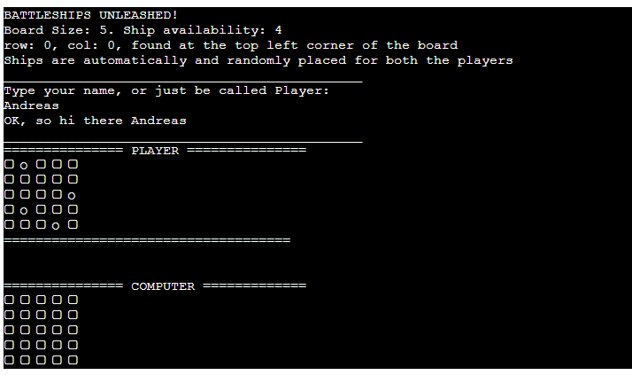
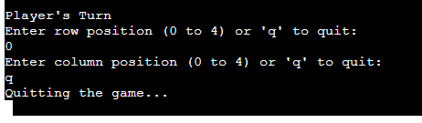
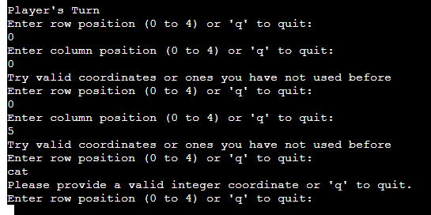
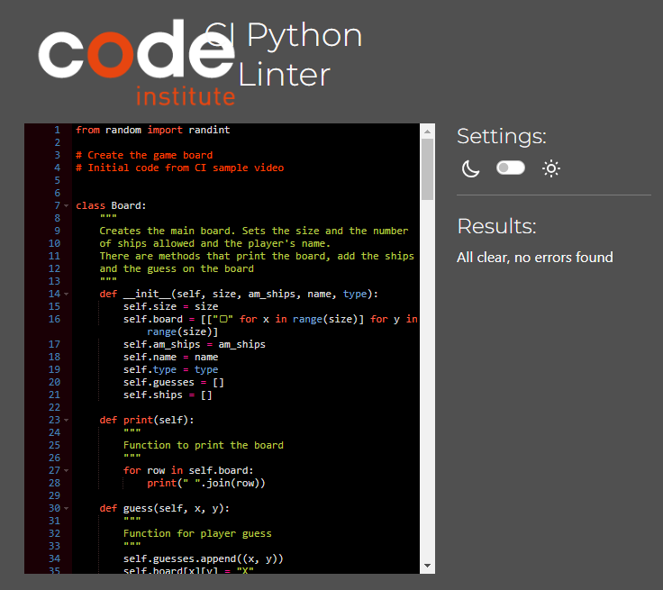

# Battleships Game

This is a simple application of the Battleships game in the Python terminal. The game is about taking guesses in turns between the player and the computer to find and destroy each other's battleships. When the maximum number of turns is reached or all the ships of either player are destroyed, the game ends.

## Game Board

The game board is represented by a grid of rounded-corner squares. Squares can contain a ship or be empty. The board is displayed using ASCII characters, with "▢" representing empty squares and "O" representing the ships placed for the player automatically and randomly when the game starts.

## Features

### Existing Features

- Random board creation
    - Automatically and randomly placed ships on both the computer and the players' boards.
    - The computer's ships are not visible to the player and vice versa.

- Play against the computer
- Takes user input
- The player can quit the game by inputting "q"

- Input validation and error-checking
    - You cannot enter the same coordinates twice
    - You cannot enter coordinates higher than the size of the grid
    - You must enter numbers

- Data maintained in class instances

### Possible Future Features

- Allow player to select the board size and the number of ships
- Allow player to place ships on the board by themselves
- Have different ship sizes
- Keep scores

## Data Model

I used a Board class as my model. It creates two class instances, one for the player and one for the computer boards.

The Board class stores the board size, the amount of ships, the placement of the ships, the guesses against that board, the board type and the player's name. 

The class also has methods to assist in the gameplay such as a "print" method to print out the boards, a "guess" method to add the guess to the board and an add_ships method to add the ships to the board.

## Testing

I have manually tested this project by doing the following:

- Passed the code through a PEP8 linter and confirmed there are no problems.
- Given invalid inputs: strings when numbers are expected, out of bound inputs, same input twice
- Tested in my local terminal and the Code Institute Heroku terminal

### Bugs
#### Solved Bugs

- Incrementing the player score and having them shown in the terminal. I managed to fix the player scores to appear and be incremented correctly but hadn't managed to do the same for the computer scores, so I decided to keep this feature out of production entirely.
- When my valid_places function was being called, I would receive multiple print() statements before even the player would add their name. I removed the print() function and added it elsewhere for the invalid inputs

#### Remaining Bugs

- Incrementing the computer score and having it shown in the terminal. I had managed to do this for the player score but hadn't managed to do the same for the computer scores, so I decided to keep this feature out of production entirely.
- When inputting an out-of-range number for the row input, it does invalidate your guess from the beginning, it waits for the column input to validate it. It will not validate the row input even if the column input is within range.
- The game will not end automatically when the player hits all of the ships on the computer's board but it will end automatically and when the computer hits all the ships on the player's board. After a lot of testing, I could only get either the player or the computer to win with this method. I decided to leave the computer as the automatic winner.
In this way, the computer always essentially always win but I decided this because the player has the option and mental capacity to quit when they have hit all of the computer's ships.

#### Validator Testing

- PEP8
    - No errors were returned from [pep8ci.herokuapp.com](https://pep8ci.herokuapp.com/)

    - 

## Deployment

This project was deployed using the Code Institute's mock terminal for Heroku.

- Steps for deployment:
    1. Fork or clone this repository
    2. Create a new Heroku app
    3. Create Config_vars in the Settings
    4. Set the buildpacks to Python and NodeJS in that order
    5. Link the Heroku app to the repository
    6. Click on Deploy

## Game Flow

1. The player and computer take turns guessing the positions of the battleships on the opponent's board.
2. The player enters the row and column coordinates for their guess.
3. The computer generates random coordinates for its guess.
4. The game checks if the guess is a hit or a miss.
5. The board is updated with "X" on each board to reflect the guess.
6. The game ends when all ships of either participant are destroyed or the maximum number of turns is reached.

## Credits
- Code institute for the deployment terminal
- The sample video in the LMS
- My mentor who checked and advised me on my code
- [W3C Schools](https://www.w3schools.com/) for code searching and clarifications.